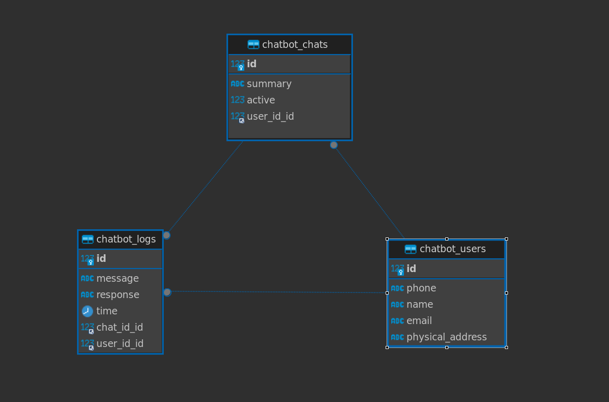

# Django-Command-Line-Chatbot-Application

## Introduction

The purpose of this repository is to showcase a Django CLI Application Using OPEN AI To Make A Simple Chatbot Interacting With Customers, Logging Their Chat, Help Him To Solve His Problem and Giving Him A Summary About his Problem and The Solutions.

## Installation

First you need to install this requirements
```sh
python -m pip install -r requirements.txt
```
Second You Need To Create Your .env with the path django_chatbot/chatbot/management/commands/.env
And Add your OPENAI_API_KEY Which you can get via https://platform.openai.com/api-keys


## To Run Django CLI
First Clone This Repo
```sh
cd django_chatbot
python manage.py  chatbot
```

## Overview of the files
chatbot/models.py Contain The Database tables that will be created in mysql db and these Tables Are

<h1 align="center">

</h1>

## Prompt Engineering
```sh
# Prompt To Collect The Customer Information
chat_log = [ 
      {
          'role': 'system', 
          'content' : 'you are given the customers information and they are 1) phone_number 2) name 3) email and wont continue unless you get all of them and print them'
      }
]

# Prompt To Get The Summary of The Customer`s Complaint and the parameters
chat_log.append( 
    {
      'role': 'system',
      'content' : 'Till now you provided with the customer`s problem, your task is to Provide a brief summary of this customer`s problem'
    }
)
response = client.chat.completions.create(
    model="gpt-3.5-turbo",
    messages=chat_log,
    temperature = 0.7,
    max_tokens = 512,
    top_p=1
)

```
